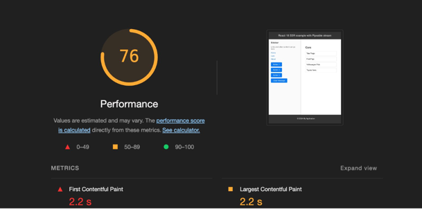

# React 18 SSR Example Using Pipeable Stream

## Traditional SSR Approach:


This example demonstrates how to render a React 18 application on the server-side using a Node.js
application. We utilize React 18's `renderToPipeableStream` function to achieve server-side
rendering (SSR) with Suspense. Both the client and server sides benefit from React 18's advanced
features, including Suspense for data fetching and asynchronous component rendering.

## Getting Started

To run this example, you need to install dependencies for both the React application (`ssr-client`) and the main Node.js application. Ensure to build the client application before starting the server application.

### Installation

1. **Install dependencies for the React application:**

   ```bash
   cd ssr-client
   npm install

2. Install dependencies for the main Node.js application:
   ```bash
   cd ..
   npm install

## Build and Start the Application

1. Build the client application:
   ```bash
   npm run build:client

2. Start the server application:
   ```bash
   npm run start:server

The start:server command starts the Node.js application, which renders the React application on the
server-side and sends the rendered content to the browser. Once the hydration occurs, the static
React application runs seamlessly in the browser.


## Available Commands
start:client: Starts the client application.
start:server: Starts the server application.
build:client: Builds the client application into static files.


## Performance Metrics

### Traditional SSR Metrics



Key Observations:

1. Poor User Experience
2. Long Initial Blank Screen


### By utilizing Suspense, the first HTML shell is served to the client using the Suspense fallbacks, significantly improving the user experience.


### Improved SSR with Suspense and HTML Streaming Metrics


### Key Benefits:

1. Faster initial render 
2. Enhanced user experience with reduced loading times

This example showcases the power of React 18's SSR capabilities with Suspense and pipeable streams,
providing a more responsive and efficient user experience.

### SSR Metrics with Selective Hydration

[selective-hydration.mp4](ssr-client/src/assets/selective-hydration.mp4)


